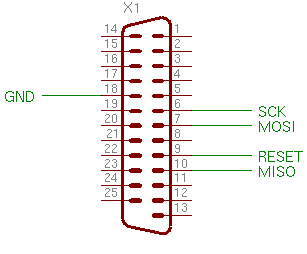
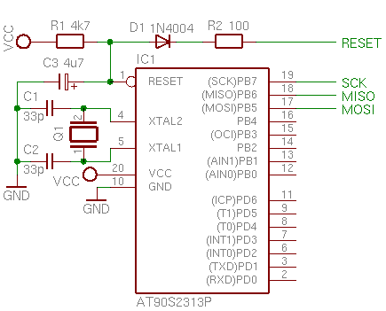

AVR i Linux
===========

Wstęp
-----

Zakładam, że wchodząc tutaj, masz chociaż podstawowe pojęcie o AVR-ach Atmela, 
Linuksie i że trzymałeś kiedyś w ręku lutownicę. Ta strona zawiera informacje o 
tym, jak za pomocą Linuksa i skrawka sprzętu można zacząć zabawę z tymi 
mikrosterownikami. Ja w tym celu kupiłem AT90S2313, który kosztuje około 5zł i 
parę innych drobazgów. 12 końcówek portów, 2kB pamięci Flash programu, 128b 
RAM, 128b EEPROMu, 2 liczniki, 2 zewnętrzne przerwania i UART powinny na 
początek wystarczyć każdemu. Mimo to, przedstawione tutaj informacje będą 
prawdziwie również dla większości mikrokontrolerów rodziny AVR.

**Uwaga!** Nieprawidłowe połączenie układów
elektronicznych może spowodować uszkodzenie komputera, pożar i inne kataklizmy.
Zamieszone tutaj informacje są udostępnione bez żadnych gwarancji itp. itd.
U mnie wszystko działa bez problemu, ale nie mogę odpowiadać za szkody powstałe
w wyniku użycia układu bazującego na moim schemacie. Twój port równoległy może
być mniej odporny na sprzęt inny niż drukarki spełniające warunki CE.


Programator i układ uruchomieniowy
----------------------------------

AVR-y najłatwiej programować przez interfejs SPI, który wymaga jedynie trzech
linii sygnałowych (SCK, MISO, MOSI) oraz jakiegoś sposobu przełączenia w tryb
programowania (RESET na niski). Jeśli Twój komputer ma jeszcze port równoległy,
możesz podłączyć w następujący sposób:



Jest to minimalna wersja programatora STK200 (brak bufora 74HC244),
który jest obsługiwany przez większość oprogramowania dla AVR-ów. Dla
uproszczenia całego układu zrezygnowałem z przełączania wyprowadzeń PB5, PB6 i
PB7 między programatorem, a urządzeniami peryferyjnymi.

W przypadku braku portu równoległego można złożyć albo kupić *) programator
z interfejsem USB jak np. [USBasp](https://www.fischl.de/usbasp/).



Można teraz podłączyć różne głupoty do portów &mdash; diody, przyciski,
wyświetlacze, konwertery TTL&lt;-&gt;RS232 itp. Wszystko to zależy od
tego, co chcesz zrobić.

*) Problem jajka i kury -- trzeba zaprogramować AVR-a, żeby zaprogramować AVR-a.

Oprogramowanie
--------------

Jednym z wygodniejszych rozwiązań jest użycie kompilatora gcc. Dzięki temu
nie trzeba uczyć się kolejnego asemblera &mdash; wystarczy poznać wnętrze
mikrosterownika i sposób jego obsługi. By zbudować środowisko niezbędne
do kompilacji i uruchamiania kodu na AVR-y należy zaopatrzyć się w:

* Narzędzia: [binutils](ftp://ftp.kernel.org/pub/linux/devel/binutils/)
* Kompilator: [gcc](ftp://ftp.gnu.org/pub/gnu/)
* Bibliotekę standardową: [avr-libc](http://www.nongnu.org/avr-libc/)
* Programator: [avrdude](http://www.nongnu.org/avrdude/)

Jeśli Twoja dystrybucja Linuksa jest oparta o pakiety RPM, najłatwiej będzie
pobrać oprogramowanie z projektu [CDK4AVR](http://cdk4avr.sourceforge.net/).
[PLD Linux](http://www.pld-linux.org/) zawiera specyfikacje odpowiednich
pakietów do samodzielnej kompilacji (`crossavr-binutils`, `crossavr-gcc`,
`crossavr-libc` i `avrdude`). W Debianie to `gcc-avr`, `binutils-avr`,
`avr-libc` itd. Gdyby jednak zaszła potrzeba samodzielnej kompilacji,
_binutils_ i _gcc_ należy skompilować po uprzednim uruchomieniu skryptu
`./configure` z parametrem `--target=avr`, a `avr-libc` z parametrem
`--host=avr`. Programatory są aplikacjami działającymi na stacji roboczej, więc
kompiluje się je tak samo jak zwykłe oprogramowanie.

Przykład
--------

Po zainstalowaniu wszystkiego, możemy napisać prosty program:

```
#define F_CPU 1000000L				/* Częstotliwość kwarcu */

#include <avr/io.h>
#include <util/delay.h>				/* Kiedyś <avr/delay.h> */

int main(void)
{
	DDRB |= _BV(0);				/* PB0 jako wyjście */

	for (;;)
	{
		unsigned char i;
		
		PORTB ^= _BV(0);		/* Zaneguj stan PB0 */
		
		for (i = 0; i < 50; i++)
		{
			_delay_ms(10);		/* Czekaj 0,5 sekundy */
		}
	}

	return 0;
}
```

Na początku należy zadeklarować częstotliwość taktowania mikrokontrolera, by
pętle opóźniające odmierzały poprawnie czas. Pisząc oprogramowanie dla AVR-ów
zgodnie z zasadami sztuki, maski bitowe należy tworzyć za pomocą makra
`_BV()`. Dostępne wcześniej makra `sbi()` oraz `cbi()`
służące odpowiednio do ustawiania i zerowania bitów, zostały usunięte. W zamian
korzysta się ze standardowych konstrukcji języka C &mdash; kompilator będzie
wiedział, gdzie można użyć instrukcji zmiany pojedynczego bitu, a gdzie
trzeba użyć operacji logicznej na wartości rejestru.

Na szczególną uwagę zasługuje pętla opóźniająca. Częstym błędem jest
używanie funkcji `_delay_us()` i `_delay_ms()` z dużymi
wartościami opóźnień. Zgodnie z <a href="http://www.nongnu.org/avr-libc/user-manual/group__util__delay.html">dokumentacją</a>, maksymalne wartości to 768 &micro;s na 1 MHz oraz 264,14 ms na 1MHz częstotliwości zegara. Wynika z tego, że na przykład
przy kwarcu 10 MHz, maksymalne opóźnienia to 76,8 &micro;s i 26,4 ms. Dla dłuższych
czasów należy wywoływać w pętli opóźnienia o mniejszej wartości.

Mając już gotowy plik źródłowy, możemy go skompilować i zaprogramować nim
mikrokontroler:

    avr-gcc -mmcu=at90s2313 program.c -o program
    avr-objcopy -O ihex program program.hex
    avrdude -c stk200 -p at90s2313 -U flash:w:program.hex

Pierwsza komenda skompiluje program i połączy go z biblioteką standardową.
Druga wyciągnie z pliku formatu ELF binarną sekcję kodu. 
Ostatnia wyzeruje zawartość pamięci Flash mikrosterownika, zapisze program
i sprawdzi, czy programowanie przebiegło poprawnie. To wszystko!

Co dalej?
---------

Najlepiej zacząć od lektury [dokumentacji biblioteki standardowej](http://www.nongnu.org/avr-libc/user-manual/)
i nie zapomnieć o sekcji [FAQ](http://www.nongnu.org/avr-libc/user-manual/FAQ.html), która
zawiera odpowiedzi na większość podstawowych pytań. Przykładowe aplikacje
można znaleźć w serwisie [AVR Freaks](http://www.avrfreaks.net/)
Pytania najlepiej zadawać na grupie dyskusyjnej [pl.misc.elektronika](news:pl.misc.elektronika),
ale tylko jeśli odpowiedzi nie znajdziesz w sieci. Powodzenia!


