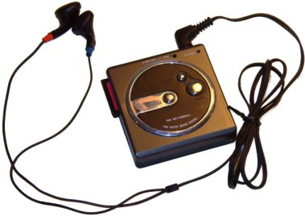
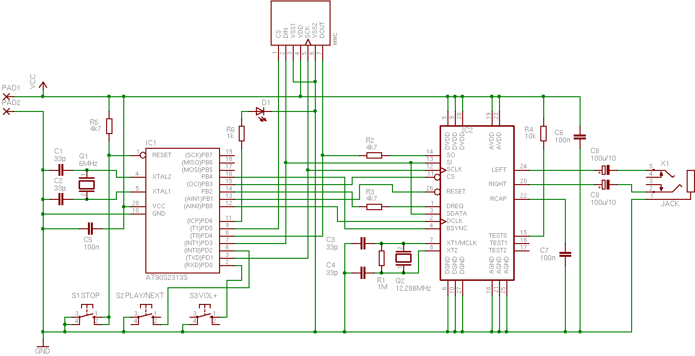
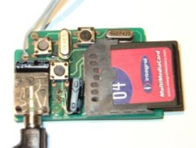

/tmp - tiny/tani mp3 player
===========================

([Wersja polska](pl.html))

Project goals
-------------

To build small, simple and as cheap as possible portable MP3 player.
Why buy something when you can do it yourself? Why assemble
<a href="http://www.yampp.com/">someone else's</a> project when you can have
your own? By the way, you can learn many useful things. The word ,,tani" in
the name means ,,cheap'' in Polish.

What's new?
-----------

<ul class="space">
<li>2005-03-03: Information about interferences and the workaround.</li>
<li>2005-01-23: Added implementation details and pictures of the project.</li>
<li>2005-01-23: Updated firmware has been put on the site.</li>
<li>2005-01-15: The project has been finished. The device has been assembled,
it works and at last I have my own MP3 player.</li>
<li>2004-08-06: First English version.</li>
</ul>

Hardware
--------

<ul class="space">
<li>MCU: <a href="http://www.atmel.com/dyn/products/product_card.asp?part_id=1993">AT90S2313</a>. It costs about $3 in Poland, it's small, works fine at 3V (even the non-,,L'' version), easy to program with gcc port. Its 15 I/O pins are enough for memory card, MP3 decoder and some buttons. It will handle 128kbps at 6MHz crystal.</li>
<li>MP3 decoder: <a href="http://www.vlsi.fi/vs1001/vs1001.htm">VS1001K</a>. The most expensive part of the project, but it seems that this is the most popular and the most available decoder chip. Besides, it doesn't require external D/A nor headphone amplifier.</li>
<li>Flash card: <a href="http://www.mmca.org/">MMC</a>. It can be handles with only 4 I/O pins.</li>
</ul>

Software and docs
-----------------

<ul class="space">
<li>avr-gcc.</li>
<li>MMC flash card docs from <a href="http://www.sandisk.com/">SanDisk</a> and <a href="http://www.hitachi.com/">Hitachi</a>.</li>
<li>VS1001K docs.</li>
<li>In crisis situations I've look at <a href="http://www.yampp.com/">YAMPP-7</a> source code.</li>
</ul>

Cons
----

<ul class="space">
<li>No LCD. Most of the time, the player will be in my pocket or backpack, so I won't use it anyway. Walkmans don't show current time and no one complains. I don't need ID3 because I know what I have uploaded to the card.</li>

<li>No PC connectivity. MCU's flash memory is too small to fit USB and MMC write support and another chip (USB inteface) and a socket would drastically increase player size. Currently the cheapest MMC card readers cost about $10, so it isn't an issue. Besides, if someone has a digital camera with MMC/SD cards, he already has a MMC reader (like I do.)</li>

<li>No fast-forward or rewind. Like in some CD-ROM drives, there are only two buttons: ⏹ stopping the playback and going back to the beginning of the playlist and ⏵/⏭ starting playback or skipping to the next track.</li>

</ul>

Pros
----

<ul class="space">
<li>It's very simple. The PCB is about 2"x1". Most of the parts can be bought in any electronics store. I bought a MP3 decoder in <a href="http://www.jelu.se/">Jelu Handelsbolag</a> in Sweden.</li>

<li>It supports FAT12 and FAT16 filesystems not some own like some DIY MP3 players. That's why you can upload files using any MMC reader under any operating system.</li>

<li>Its software is available under the terms of GPL.</li>
</ul>

Implementation details
----------------------

<ul class="space">
<li>MCU is run at 6MHz because it's the lowest frequency at which 128kbps
files are played correctly. If you want to play higher quality files at the
cost of higher power consumption, you should use faster crystal.</li>

<li>After power-up the MCU goes to idle mode so it consumes minimal amount
of energy. Play button is connected to external interrupt pin and pressing
it wakes up the MCU and starts the playback. When playing, the forward
button is polled by software. Stop button is connected to reset input so
it doesn't have to be checked by software.</li>

<li>Because of troubles with getting 12.288MHz crystal, 12MHz has been used.
The difference in playback speed is about 2% to it's barely noticable.</li>

<li style="color: red;">Ground and power wires on the first revision of the
board are are too thin and it causes audible interferences. The workaround
it to connect MCU ground with battery pad with a thick wire as seen on the
prototype image.</li>

</ul>

Schematic
---------

Board
-----

Pictures of prototype
---------------------

 

Firmware
--------

Available at [project page](https://github.com/wojtekka/tmp/releases/)

