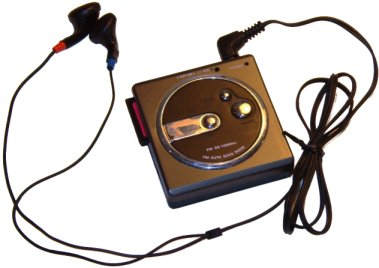
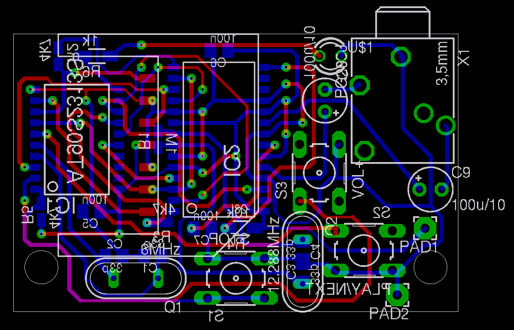
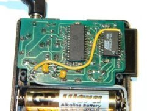
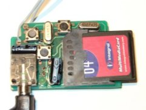

/tmp - tiny/tani mp3 player
===========================

([English version](en.html))

Cel projektu
------------

Zbudowanie jak najmniejszego, jak najprostszego i jak najtańszego,
przenośnego odtwarzacza MP3. Po co kupować coś, co można zrobić samemu?
Po co składać [cudzy projekt](http://www.yampp.com/),
skoro można mieć własny od zera? Przy okazji można nauczyć się wielu
przydatnych rzeczy. I mieć sensowne zajęcie na kilka wieczorów.
Skąd taka głupia nazwa? Nie mam pojęcia.

Co nowego?
----------

* 2005-03-03: Informacja o zakłóceniach i sposobie obejścia problemu.
* 2005-02-07: Dodanie informacji o szczegółach implementacji i zdjęć projektu.
* 2005-01-23: Umieszczenie na stronie uaktualnionego oprogramowania.
* 2005-01-15: Projekt można uznać za zakończony. Urządzenie zostało złożone, działa, mam w końcu odtwarzacz MP3.
* 2004-03-28: Z powodu braku czasu na dopieszczenie płytki, postanowiłem opublikować źródła. Komentarze, sugestie, uwagi i poprawki mile widziane. Dla tych, których nie lubią dużo czytać, droga na [skróty](https://github.com/wojtekka/tmp/releases/)
* 2004-02-13: Znalazłem już odpowiednią obudowę (radyjko kupione w sklepie _Wszystko za 5zł_). Niestety ze względu na mikroskopijne rozmiary nie dam rady upakować wszyskiego na płytce jednostronnej. Nie zmieszczę też żadnej przetwornicy. Za to mam łądną obudowę z miejscem na 3 przyciski (regulacja głośności będzie cyklicznie w górę) i dwie baterie AAA. Zostało tylko upchnąć
wszystko na płytce wymiarów 5x2,5 cm.
* 2003-12-23: Pierwsza wersja strony.

Wykorzystany sprzęt
-------------------

* Procesor [AT90S2313](http://www.atmel.com/dyn/products/product_card.asp?part_id=1993). Kosztuje poniżej 5zł, jest mały, bez problemu działa z zasilaniem 3V (nawet w wersji bez _L_), łatwo go oprogramować dzięki istnieniu portu _gcc_. Jego 15 pinów w zupełności wystarczy do obsługi karty pamięci, dekodera MP3 i kilku przycisków, a przy zegarze 6 MHz bez problemu obsłuży strumień 128 kbps.
* Dekoder [VS1001K](http://www.vlsi.fi/vs1001/vs1001.htm). Tani nie jest (około $20, najdroższa część projektu), ale wygląda na to, że jest najpopularniejszy i najłatwiej dostępny. Poza tym nie wymaga zewnętrznego przetwornika C/A, ani wzmacniacza słuchawkowego.
* Karta pamięci [MMC](http://www.mmca.org/). Do obsługi wystarczą tylko 4 piny procesora.

Wykorzystane oprogramowanie i materiały
---------------------------------------
* _avr-gcc_
* Dokumentacja kart MMC firm [SanDisk](http://www.sandisk.com/) i [Hitachi](http://www.hitachi.com/)
* Dokumentacja dekodera VS1001K
* W sytuacjach kryzysowych zaglądałem do źródeł [YAMPP-7](http://www.yampp.com/)

Wady
----

* Brak wyświetlacza LCD. Przez większość czasu odtwarzacz i tak będzie leżeć w kieszeni albo plecaku, więc z wyświetlacza nie skorzystam. Walkmany nie wyświetlają aktualnego czasu i nikt z tego powodu nie płacze. Tagi ID3 nie są mi potrzebne, bo dobrze wiem, co załadowałem na kartę.
* Brak możliwości wrzucenia plików na kartę. Pamięć użytego procesora jest zbyt mała, żeby zmieścić obsługę USB i zapisu na kartę. Poza tym, kolejny układ i gniazdo USB znacznie zwiększyłyby rozmiar odtwarzacza. W tej chwili najprostsze czytniki kart MMC kosztują mniej niż 50zł. Poza tym, jeśli ktoś ma cyfrowy aparat fotograficzny na karty tego typu, może z niego korzystać do wrzucania plików (ja tak robię).
* Brak możliwości przewijania utworów. Tak jak w komputerowych odtwarzaczach CD, są dwa przyciski: ⏹ zatrzymujący odtwarzanie i wracający na początek listy oraz ⏵/⏭ rozpoczynający odtwarzanie lub przechodzący do kolejnego utworu.

Zalety
------

* Bardzo prosta budowa. ~~Projektu płytki jeszcze nie ma, ale będzie to płytka jednostronna, którą będzie można wykonać nawet ręcznie.~~ Większość części można dostać w każdym sensownie zaopatrzonym sklepie elektronicznym. Dekoder MP3 kupiłem w [Jelu Handelsbolag](http://www.jelu.se/) w Szwecji jeszcze przed wstąpieniem Polski do Unii Europejskiej (teraz jest droższy ze względu na podatek). Złącze karty MMC w [Cyfronice](http://www.cyfronika.com.pl/). Jeśli w Twoim sklepie nie ma AT90S2313, spróbuj w [Seguro](http://www.seguro.pl/).
* Obsługa systemów plików FAT12 i FAT16, a nie własnego, jak w innych odtwarzaczach MP3 do samodzielnego złożenia. Dlatego pliki można wrzucać na kartę za pomocą dowolnego czytnika, pod dowolnym systemem operacyjnym.
* Oprogramowanie dostępne na licencji GPL.

Szczegóły implementacji
-----------------------

* Procesor jest taktowany zegarem 6MHz, ponieważ jest to najniższa częstotliwość przy której poprawnie były odtwarzane pliki 128kbps. Jeśli chcesz odtwarzać pliki większej jakości, kosztem większego zużycia prądu, powinieneś użyć szybszego zegara.
* Po uruchomieniu procesor wchodzi w stan uśpienia, dzięki czemu pobiera minimalną ilość energii. Przycisk rozpoczynający odtwarzanie jest podłączony do wejścia przerwania, więc wciśnięcie budzi procesor ze snu i rozpoczynane jest otwarzanie. Przejście do kolejnego utworu jest obsługiwane programowo.  Przycisk zatrzymujący odtwarzanie podłączono do wejścia zerującego procesora, dzięki czemu nie ma konieczności programowej obsługi.
* Ze względu na trudności ze zdobyciem kwarcu 12,288MHz, wykorzystano zwykły kwarc 12MHz. Różnica prędkości odtwarzania około 2% jest praktycznie niezauważalna.
* Ścieżki masy i zasilania w pierwszej wersji płytki są dość cienkie, co powoduje słyszalne zakłócenia. Pomaga połączenie kawałkiem grubego przewodu masy procesora z padem baterii tak jak to widać na zdjęciu prototypu.

Schemat
-------

Płytka
------

Zdjęcia prototypu
-----------------

 

Firmware
--------

Dostępne na [stronie projektu](https://github.com/wojtekka/tmp/releases/)

Co potem?
---------

* Zrobić sobie czytnik kart MMC, żeby nie musieć przekładać kart w aparacie co chwilę. Ale to już inna bajka.
* Jeśli [Atmel](http://www.atmel.com/) wypuści układ zgodny od strony pinów z 2313, ale z większą pamięcią Flash, pomyśleć co jeszcze można dorzucić.
